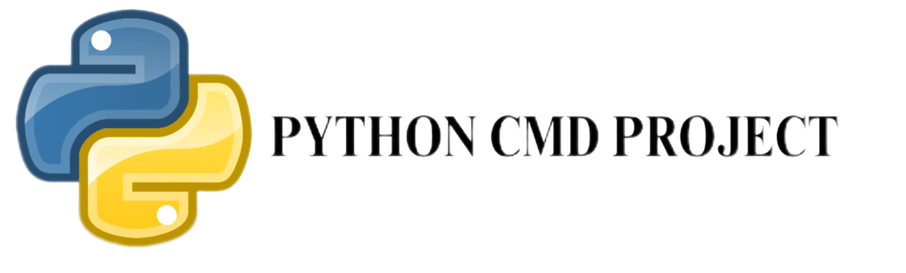

# PYDOS Version 1.5 Advanced

The third version of the Python command line has been released, which is significantly better than the Beta and Alpha versions. PYDOS is a tool for finding IP addresses and converting codes.

## Features

PYDOS includes the following commands that allow you to perform various tasks:

- `dir`: List directories
- `find`: Find a file
- `help`: Display help
- `dash`: Show device information (requires root access)
- `calc`: Calculator
- `echo`: Print a message
- `date`: Show the date
- `time`: Show the time
- `edit`: Edit a file
- `mkdir`: Create a folder
- `rd`: Remove a folder or file
- `xcopy`: Copy a folder
- `cIP`: Change IP (requires root access)
- `ifconfig`: Show IP address
- `zip`: Compress files into ZIP format
- `unzip`: Extract files from ZIP format
- `setting`: PYDOS settings
- `ipfinder`: Open the IPFINDER program
- `tracker`: Open the IP TRACKER program
- `bashrc`: Bash Converter
- `wenda`: Wenda Converter
- `backup`: Backup all files
- `restore`: Restore files
- `bootinf`: Show boot version
- `ver`: Show PYDOS version
- `cd`: Change directory
- `bomb`: pybomber
- `pyrun`: Run a Python file
- `cls`: Clear the screen
- `defpath`: Show the current directory
- `appmgr`: App Manager 
- `exit`: Exit PYDOS

## Installation

To install PYDOS, follow these steps:

1. First, create a folder for PYDOS:
    ```bash
    mkdir Pydos
    ```
2. Then, clone Pydos from GitHub:
    ```bash
    git clone https://github.com/T7280H/pydos1-5advance.git
    ```
3. Navigate to the setup folder:
    ```bash
    cd SETUP
    ```
4. And run setup.py:
    ```bash
    python setup.py
    ```

## Contact Us

- **Telegram ID**: @t7280h
- **Rubika ID**: @t7280h_git

## License

```license
MIT License

Copyright (c) 2025 T7280H

Permission is hereby granted, free of charge, to any person obtaining a copy
of this software and associated documentation files (the "Software"), to deal
in the Software without restriction, including without limitation the rights
to use, copy, modify, merge, publish, distribute, sublicense, and/or sell
copies of the Software, and to permit persons to whom the Software is
furnished to do so, subject to the following conditions:

The above copyright notice and this permission notice shall be included in all
copies or substantial portions of the Software.

THE SOFTWARE IS PROVIDED "AS IS", WITHOUT WARRANTY OF ANY KIND, EXPRESS OR
IMPLIED, INCLUDING BUT NOT LIMITED TO THE WARRANTIES OF MERCHANTABILITY,
FITNESS FOR A PARTICULAR PURPOSE AND NONINFRINGEMENT. IN NO EVENT SHALL THE
AUTHORS OR COPYRIGHT HOLDERS BE LIABLE FOR ANY CLAIM, DAMAGES OR OTHER
LIABILITY, WHETHER IN AN ACTION OF CONTRACT, TORT OR OTHERWISE, ARISING FROM,
OUT OF OR IN CONNECTION WITH THE SOFTWARE OR THE USE OR OTHER DEALINGS IN THE
SOFTWARE.
```

